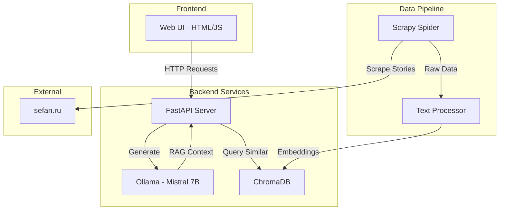

# Erotic Story Generator Architecture Plan

## Overview

A local RAG-based story generator using Gemma 2B LLM, optimized for Russian language content and M1 MacBook performance.

## Architecture Components

### 1. LLM Infrastructure

- **Model**: Mistral 7B Instruct (via Ollama)
  - Optimal for M1 with 16GB RAM
  - Quantized version (Q4_K_M) for better performance
  - Supports Russian language generation

### 2. Vector Database

- **ChromaDB**: Lightweight, embedded vector database
  - Docker-friendly deployment
  - Persistent storage support
  - Good performance on M1 architecture

### 3. Web Scraping

- **Scrapy**: For scraping sefan.ru stories
- **BeautifulSoup4**: For HTML parsing assistance
- **Rotating User-Agents**: To avoid blocking

### 4. RAG Pipeline

- **LangChain**: For RAG orchestration
- **Sentence-Transformers**: multilingual-e5-base for Russian embeddings
- **Text Splitter**: RecursiveCharacterTextSplitter for Russian text

### 5. Backend API

- **FastAPI**: Modern Python web framework
- **Pydantic**: Data validation
- **python-multipart**: File upload support

### 6. Frontend UI

- **HTML/CSS/JavaScript**: Simple form-based interface
- **Tailwind CSS**: For styling
- **Alpine.js**: Lightweight reactivity

### 7. Infrastructure

- **Docker & Docker Compose**: Container orchestration
- **Nginx**: Reverse proxy
- **PostgreSQL**: Metadata storage (optional)

## System Architecture Diagram



## Directory Structure

```
story-generator/
├── docker-compose.yml
├── .env
├── scraper/
│   ├── Dockerfile
│   ├── scrapy.cfg
│   ├── requirements.txt
│   └── sefan_scraper/
│       ├── spiders/
│       │   └── stories_spider.py
│       ├── items.py
│       ├── pipelines.py
│       └── settings.py
├── backend/
│   ├── Dockerfile
│   ├── requirements.txt
│   ├── main.py
│   ├── config.py
│   ├── models/
│   ├── services/
│   │   ├── llm_service.py
│   │   ├── rag_service.py
│   │   └── vector_db.py
│   └── api/
│       └── endpoints.py
├── frontend/
│   ├── index.html
│   ├── style.css
│   └── script.js
├── data/
│   ├── raw_stories/
│   ├── processed/
│   └── chroma_db/
└── nginx/
    └── nginx.conf
```

## Key Design Decisions

### 1. Model Selection

- **Mistral 7B Instruct (Q4_K_M)**: Best balance of quality and performance for M1
- Runs efficiently with ~8GB RAM usage
- Good Russian language understanding

### 2. Embedding Model

- **multilingual-e5-base**: Excellent Russian language support
- 768-dimensional embeddings
- Cached locally for offline use

### 3. RAG Strategy

- Chunk size: 1000 characters (optimal for story context)
- Overlap: 200 characters
- Top-k retrieval: 5 most relevant chunks
- Hybrid search: Combining semantic and keyword search

### 4. Scraping Strategy

- Respectful crawling with delays
- Story categorization preservation
- Metadata extraction (author, tags, rating)

## Performance Optimizations for M1

1. **Quantized Models**: Use 4-bit quantization for LLM
2. **Batch Processing**: Process embeddings in batches
3. **Metal Performance Shaders**: Leverage M1 GPU via Ollama
4. **Memory Management**: Implement proper cleanup and limits
5. **Caching**: Redis for frequently accessed stories

## Security Considerations

1. **Input Sanitization**: Clean user inputs
2. **Rate Limiting**: Prevent abuse
3. **Content Filtering**: Age verification
4. **Local Deployment**: No external API dependencies

## Monitoring and Logging

1. **Prometheus**: Metrics collection
2. **Grafana**: Visualization (optional)
3. **Structured Logging**: JSON format
4. **Error Tracking**: Local error logs

## Next Steps

1. Create project structure
2. Set up Docker environment
3. Implement Scrapy spider
4. Configure vector database
5. Build RAG pipeline
6. Create API endpoints
7. Develop web interface
8. Test and optimize
